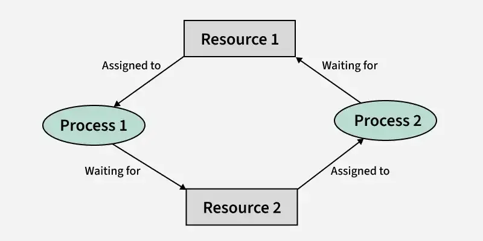

# Deadlocks

## 1. Introduction to Deadlock


### Definition
A deadlock is a permanent blocking state where:
- Two or more processes are waiting for each other
- Each process holds a resource and waits for other resources
- None of them can proceed without the resources held by others

### Real-world Analogy

**Classic Dining Philosophers Problem**
- 5 philosophers at round table
- 5 forks between them
- Need 2 forks to eat
- Each picks up one fork and waits for anothe

## 2. Coffman Conditions for Deadlock
All four conditions must occur simultaneously for deadlock:

### 2.1 Mutual Exclusion
- Resources cannot be shared
- Examples:
  - Printer can only be used by one process
  - Database record being updated
  - Memory allocation

### 2.2 Hold and Wait
- Process holds at least one resource
- Waits for additional resources

```
Process A --holds--> Resource 1 --needed by--> Process B
Process B --holds--> Resource 2 --needed by--> Process A
```

### 2.3 No Preemption
- Resources can't be forcibly taken
- Only voluntary release allowed
- Example: Can't force-quit a process writing to a file

### 2.4 Circular Wait
- Circular chain of processes
- Each waiting for resource held by next process
```
P1 → P2 → P3 → P4 → P1 (circular chain)
```

## 3. Resource Allocation Graph (RAG)
A graph showing processes as circles, resources as squares, request edges as arrows from processes to resources, and allocation edges as arrows from resources to processes)

### Components
- Processes (circles)
- Resources (squares)
- Request edges (P → R)
- Assignment edges (R → P)

### Interpretation
- Cycle in graph indicates possible deadlock
- No cycle = No deadlock
- Cycle with single instance = Definite deadlock
- Cycle with multiple instances = Possible deadlock

## 4. Banker's Algorithm (Detailed)

### 4.1 Data Structures
```
Available: Vector of length m (available resources)
Max: n × m matrix (maximum demand)
Allocation: n × m matrix (currently allocated)
Need: n × m matrix (remaining need)
Where:
n = number of processes
m = number of resource types
```

### 4.2 Algorithm Steps

#### Safety Algorithm
1. Initialize:
   ```
   Work = Available
   Finish[i] = false for all i
   ```

2. Find process that can be satisfied:
   ```
   Find i where:
   Finish[i] = false
   Need[i] ≤ Work
   ```

3. Update:
   ```
   Work = Work + Allocation[i]
   Finish[i] = true
   ```

4. Repeat until:
   - All Finish[i] = true (safe state)
   - No eligible process found (unsafe state)

#### Resource Request Algorithm
1. Check if request is valid:
   ```
   Request ≤ Need
   Request ≤ Available
   ```

2. Try allocation:
   ```
   Available = Available - Request
   Allocation = Allocation + Request
   Need = Need - Request
   ```

3. Run Safety Algorithm
   - If safe: allocation granted
   - If unsafe: revert changes

### 4.3 Example Scenario
```
3 Processes (P0, P1, P2)
3 Resource types (A, B, C)

Available = [3,3,2]

Max = [7,5,3]  // P0
     [3,2,2]  // P1
     [9,0,2]  // P2

Allocation = [0,1,0]  // P0
            [2,0,0]  // P1
            [3,0,2]  // P2

Need = Max - Allocation
```

## 5. Deadlock Prevention Strategies

### 5.1 Mutual Exclusion Prevention
- Use shareable resources
- Implement spooling
- Buffer outputs

### 5.2 Hold and Wait Prevention
```
Strategy 1: Request all resources initially
Process {
    request(all_resources);
    use(resources);
    release(all_resources);
}

Strategy 2: Release current before requesting new
Process {
    release(current_resources);
    request(new_resources);
}
```

### 5.3 No Preemption Prevention
- Implement resource preemption
- Save process state
- Restore when resources available

### 5.4 Circular Wait Prevention
- Order resources numerically
- Request in ascending order
```
R1 < R2 < R3 < ... < Rn
```

## 6. Deadlock Detection

### 6.1 Wait-For Graph
- Simplified RAG
- Only shows process dependencies
- Cycle indicates deadlock

### 6.2 Detection Algorithm
```pseudocode
1. Mark all processes unvisited
2. For each process:
   - Perform DFS
   - If cycle found, deadlock exists
3. If no cycles, no deadlock
```

## 7. Recovery Methods

### 7.1 Process Termination
1. **Kill all deadlocked processes**
   - Drastic but simple
   - High cost

2. **Kill one process at a time**
   - Until deadlock cycle breaks
   - Select based on:
     - Priority
     - Computation time
     - Resources held
     - Resources needed

### 7.2 Resource Preemption
1. Select victim
2. Rollback to safe state
3. Starvation prevention

## 8. Implementation Examples

### 8.1 Database Transaction Deadlock
```sql
-- Transaction 1
BEGIN TRANSACTION;
UPDATE Account1 SET balance = balance - 100;
UPDATE Account2 SET balance = balance + 100;
COMMIT;

-- Transaction 2 (concurrent)
BEGIN TRANSACTION;
UPDATE Account2 SET balance = balance - 50;
UPDATE Account1 SET balance = balance + 50;
COMMIT;
```

### 8.2 Thread Deadlock
```cpp
mutex_a.lock();
mutex_b.lock();
// Critical section
mutex_b.unlock();
mutex_a.unlock();
```

## 9. Best Practices

1. **Design Level**
   - Resource hierarchy
   - Timeout mechanisms
   - Dead

lock detection

2. **Implementation**
   - Consistent lock ordering
   - Try-lock mechanisms
   - Avoid nested locks

3. **Monitoring**
   - Deadlock detection systems
   - Resource usage tracking
   - Process state monitoring
