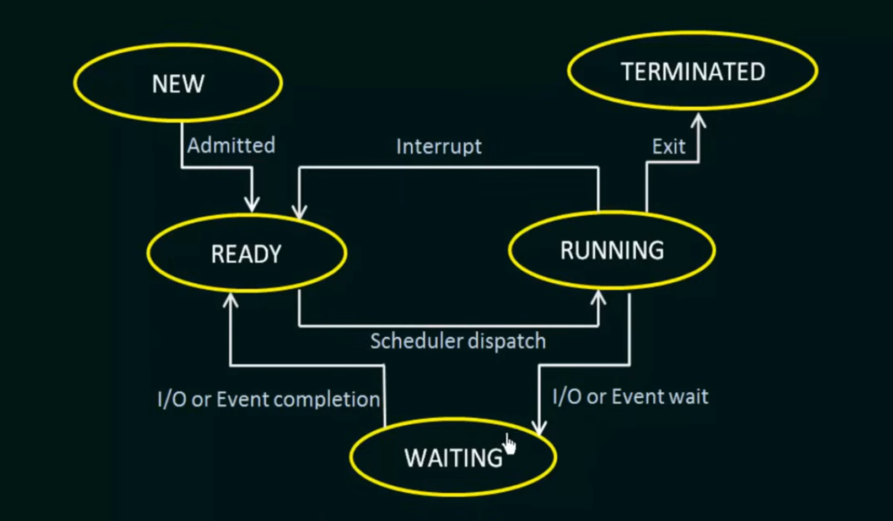

# Operating System Process States

## 1. New State
- Initial state when a process is first created
- Process control block (PCB) is created
- Process exists but is not yet loaded into memory
- Also called "Created State"

## 2. Running State
- Process is currently being executed by CPU
- Instructions are being processed
- Only one process can be in running state per CPU core
- Process has all required resources
- Can transition to:
  - Ready state (when time quantum expires)
  - Waiting state (when I/O or resource request made)
  - Terminated state (when execution completes)

## 3. Waiting State
- Process waiting for some event or resource
- Cannot execute until event occurs
- Common reasons:
  - I/O operations
  - Waiting for child process
  - Timer completion
  - Resource availability
- Also called "Blocked State"

## 4. Ready State
- Process is loaded in memory
- Ready to be executed
- Waiting for CPU allocation
- Multiple processes can be in ready state
- Managed by CPU scheduler
- Transitions to running state when selected by scheduler

## 5. Terminated State
- Process has completed execution
- Final state in process lifecycle
- Resources are deallocated
- PCB is deleted
- Process removed from memory
- Can occur due to:
  - Normal completion
  - Parent process termination
  - System errors
  - Manual termination

### State Transitions Diagram:
```ascii
                    CPU Scheduler Dispatch
    New ----→ Ready -----------→ Running ---→ Terminated
                ↑                   |
                |                   |
                └-------------------↓
                    I/O or Event    Waiting
                    Completion      (Blocked)
```

