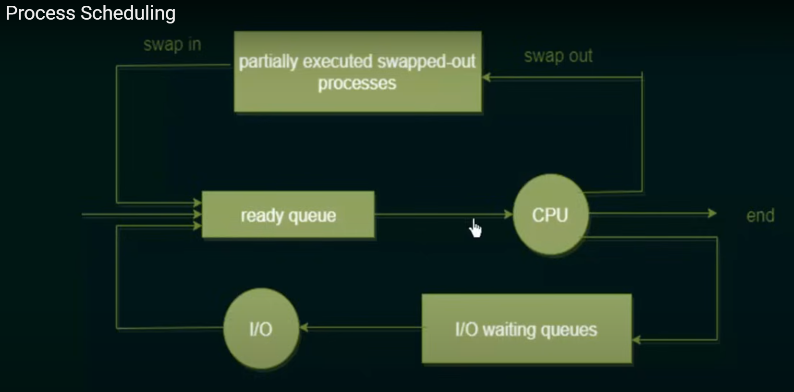

# Process Scheduling

## 1. Multiprogramming Basics
> Think of it as multitasking on your computer

### What is Multiprogramming?
- **Definition**: Multiple processes running at all times
- **Main Goal**: Maximize CPU utilization
- **How it works**: When one process waits (like for I/O), another runs

### Benefits:
- Reduced CPU idle time
- Better resource utilization
- Improved system throughput

## 2. Time Sharing
> Like multiple users sharing a single computer efficiently

### Key Concepts:
- Fast CPU switching between processes
- Each process gets small time slices
- Creates interactive user experience
- Typical time slice: 10-100 milliseconds

## 3. Process Scheduler 🎮
> The traffic controller of your computer

### Main Functions:
1. Selects next process to run
2. Maintains different process queues
3. Handles process switching
4. Ensures fair CPU distribution

## 4. Queue Types 

### Job Queue
- Contains **ALL** processes in system
- Stored on disk (permanent storage)
- Managed by long-term scheduler
- Entry point for new processes

### Ready Queue
- Contains processes ready for execution
- Stored in main memory (RAM)
- Managed by short-term scheduler
- Direct source for CPU execution

## 5. Process State Transitions 🔄

## Important Points to Remember! 🌟
1. **Multiprogramming**
   - Keeps CPU busy
   - Multiple processes in memory
   - Improves system efficiency

2. **Time Sharing**
   - Enables interactive computing
   - Fast process switching
   - Fair CPU distribution

3. **Queues**
   - Job Queue = Master list (ALL processes)
   - Ready Queue = Waiting for CPU
   - Process can move between queues
