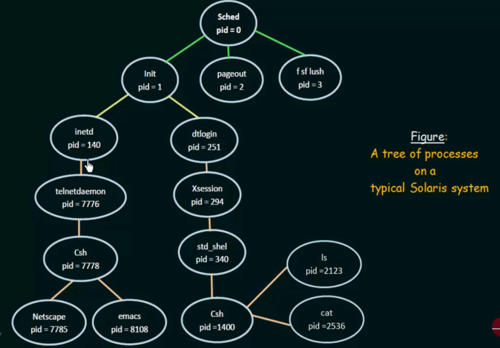

# Process Creation

## 1. Process Creation Basics

### System Call
- OS provides `fork()` or `CreateProcess()` system calls
- Parent process initiates creation
- OS allocates resources and assigns Process ID

### Example System Call
```c
// Basic process creation in Unix systems
pid_t child_pid = fork();
if (child_pid == 0) {
    // Child process code
} else if (child_pid > 0) {
    // Parent process code
}
```

## 2. Parent-Child Relationship 👨‍👦

### Characteristics
- Each process has unique Process ID (PID)
- Parent's PID stored as PPID in child
- Forms hierarchical structure
- Resources can be shared or independent

## 3. Process Tree Structure 🌲

```plaintext
        Init (PID 1)
           |
    ┌──────┴──────┐
  Shell         Chrome
    |             |
  Editor     Tab1   Tab2
```



## 4. Execution Behavior

### Concurrent Execution
- Parent and child run simultaneously
- Independent execution paths
- Resource sharing possible

### Sequential Execution
- Parent waits for child completion
- Uses `wait()` system call
- Common in command processing

## 5. Address Space Options

### 1. Duplicate Model
- Child copies parent's address space
- Same program, different data
- Example: Unix `fork()`

### 2. New Program Model
- Child loads new program
- Fresh address space
- Example: Unix `exec()`

## Key Points to Remember 🎯
1. Process creation uses system calls
2. Parent-child forms tree structure
3. Two execution models: concurrent/wait
4. Two address space options: duplicate/new
5. Resource sharing is flexible