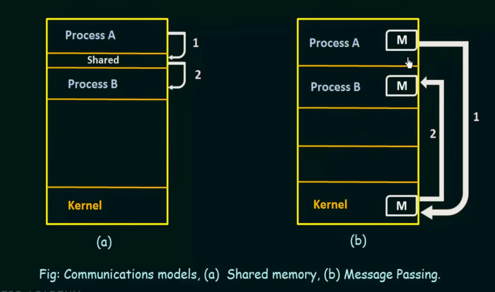

# Interprocess Communication (IPC) in Operating Systems 📡

## 1. Understanding IPC
> Mechanism allowing processes to communicate and synchronize their actions

### Types of Processes
1. **Independent Processes**
   - Cannot affect or be affected by other processes
   - Execute separately without sharing data

2. **Cooperating Processes**
   - Can affect or be affected by other processes
   - Share data with other processes

## 2. Why We Need IPC? 🎯

### 1. Information Sharing
- Multiple users accessing same data
- Example: Shared database connections
```markdown
User1 Process ↔ Shared Data ↔ User2 Process
```

### 2. Computation Speedup
- Break tasks into subtasks
- Parallel processing
```markdown
Main Task
   ↓
[Subtask1] → [Subtask2] → [Subtask3]
   ↓            ↓            ↓
Parallel Processing & Communication
```

### 3. Modularity
- System divided into separate modules
- Modules communicate through IPC
```markdown
Module A ↔ IPC Channel ↔ Module B
```

### 4. Convenience
- Multiple processes working together
- Avoid resource conflicts

## 3. IPC Models 🔄

### A. Shared Memory Model
```markdown
Process A                Process B
    ↓                       ↓
[Local Memory]         [Local Memory]
    ↓                       ↓
    ----[Shared Memory]----
```

#### Characteristics:
- Fast communication
- Direct memory access
- Requires synchronization
- System call only needed for setup

### B. Message Passing Model
```markdown
Process A → [Kernel] → Process B
    ↑                    ↑
    send()           receive()
```

#### Characteristics:
- Easier to implement
- Works across multiple computers
- More overhead than shared memory
- Kernel manages communication

