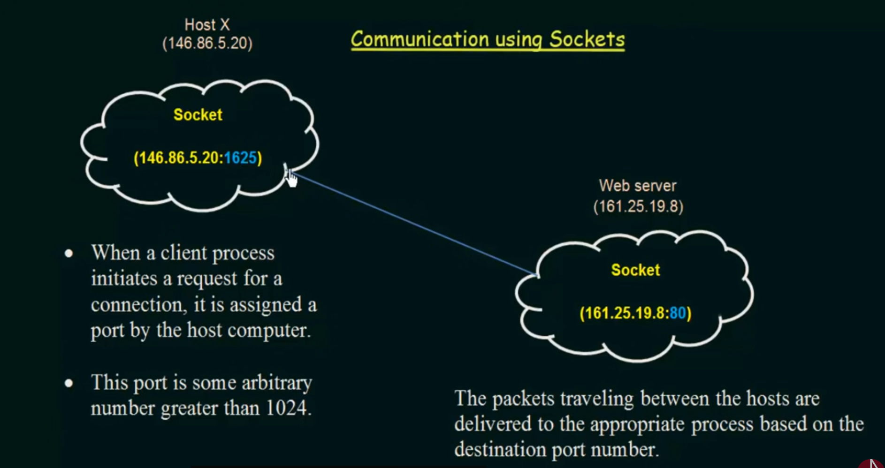

# Socket Programming in Operating Systems

## Introduction to Sockets
- End points of communication between processes
- Identified by combination of:
  - IP Address
  - Port Number



## Socket Components

### Port Numbers
- Below 1024: Reserved for system services
- Above 1024: Available for user processes
- Well-known ports:
  - 80: HTTP
  - 22: SSH
  - 443: HTTPS

## Basic Socket Communication

```c++
#include <sys/socket.h>
#include <netinet/in.h>

int createSocket() {
    int sockfd = socket(AF_INET, SOCK_STREAM, 0);
    if (sockfd < 0) {
        throw std::runtime_error("Socket creation failed");
    }
    return sockfd;
}
```

## Connection Process

1. Server Creation


2. Client Connection


## Testing Socket Applications
- Use localhost for development
- Test different network conditions
- Verify proper connection closure
- Check resource cleanup