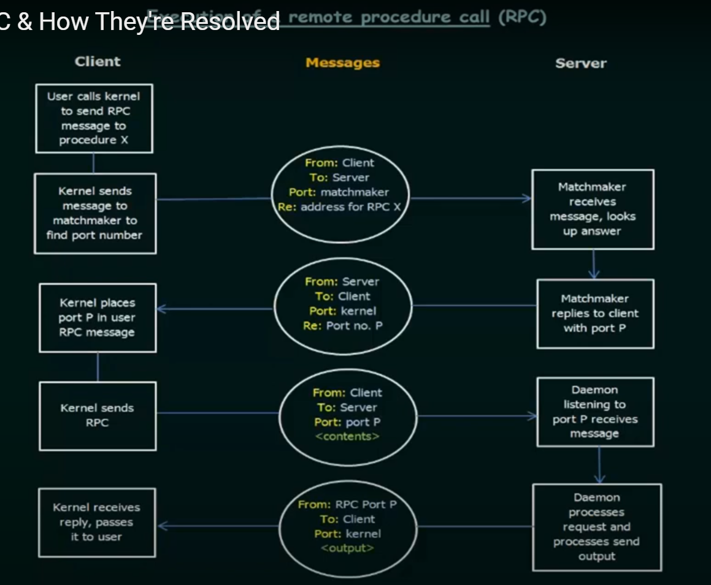

# Issues in Remote Procedure Calls (RPC)

## Core Issues and Solutions

### 1. Data Representation Issues

#### Problem
- Different systems represent data differently
- Byte ordering variations (Big-endian vs Little-endian)
- Integer size differences
- Floating-point representations

#### Solution: XDR (eXternal Data Representation)
- Standardized data format
- Machine-independent encoding
- Common data type definitions

```c
// Example XDR structure
struct example_data {
    int integer;
    float decimal;
    string text<>;
};
```

### 2. Network Communication Issues

#### Problems
- Network failures
- Duplicate requests
- Lost responses
- Request timeouts

#### Solutions

##### a) Execution Semantics
- Exactly-once execution
- Idempotent operations
- Transaction IDs

##### b) Implementation Approaches
```python
class RPCHandler:
    def __init__(self):
        self.transaction_log = {}
        
    def handle_request(self, transaction_id, request):
        if transaction_id in self.transaction_log:
            return self.transaction_log[transaction_id]
        
        result = self.execute_procedure(request)
        self.transaction_log[transaction_id] = result
        return result
```

### 3. Port Address Resolution

#### Problems
- Unknown server port numbers
- Dynamic port allocation
- Multiple services on same machine
- Match maker

#### Solutions

1. **Fixed Port Numbers**
   - Predefined port assignments
   - Well-known ports for services

2. **Rendezvous Mechanism**
   - Port mapper service
   - Dynamic port discovery
   - Service registration



## Issues with RPCs in Brief

1. Difference in representation of data in different systems. Can be solved by using a machine-independent representation of data. Practical example is XDR(eXternal Data Representation.
2. Network issues can make redundant calls or cause a failure of the procedure execution. Can be solved by ensuring that the OS executes the procedure exactly once not at most once.
3. RPCs requires that the client knows the server's port address where the RPC daemon is running on. This can be solved by agreeing on a fixed port numbers for communication, or dynamically finding out the port address using the rendezvous mechanism.