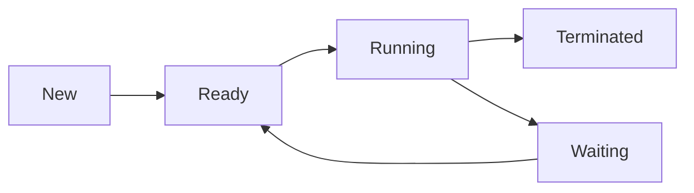

# CPU Scheduling

### What is CPU Scheduling?
CPU scheduling is the mechanism that determines which process gets CPU time for execution while others wait. It aims to:
- Maximize CPU utilization
- Minimize response time
- Ensure fairness
- Maximize throughput

### Process States
````markdown

````

### Types of CPU Scheduling

1. **Preemptive Scheduling**
   - Process can be interrupted mid-execution
   - Better for time-sharing systems
   ```c
   // Example of preemption using signals
   void handler(int signum) {
       printf("Process interrupted\n");
   }
   
   int main() {
       signal(SIGINT, handler);
       while(1) {
           // Process execution
       }
       return 0;
   }
   ```

2. **Non-preemptive Scheduling**
   - Process runs until completion or voluntary release
   - Simpler to implement

### Key Terms
- **Burst Time**: Time required by process for CPU execution
- **Arrival Time**: Time when process enters ready queue
- **Waiting Time**: Time spent waiting in ready queue
- **Turnaround Time**: Total time from arrival to completion

### Simple Scheduler Implementation
```python
class Process:
    def __init__(self, pid, burst_time):
        self.pid = pid
        self.burst_time = burst_time
        self.waiting_time = 0

def fcfs_scheduler(processes):
    current_time = 0
    for p in processes:
        p.waiting_time = current_time
        current_time += p.burst_time
```

### Context Switch
- Saving current process state
- Loading new process state
- Overhead cost consideration