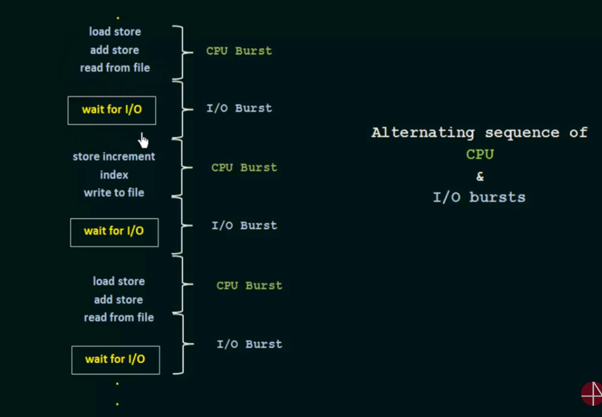

# CPU and I/O Burst Cycles

## Core Idea

A process alternates between CPU bursts (executing instructions) and I/O bursts (waiting for I/O operations). The process typically ends with a CPU burst.

## CPU Burst

*   **Definition:** Period when the process is actively using the CPU.
*   **Characteristics:** Computation, data processing, decision-making.

## I/O Burst

*   **Definition:** Period when the process is waiting for an I/O operation to complete.
*   **Characteristics:** File access, network communication, user input.

## Cycle


## Implications

*   **CPU-bound processes:** Long CPU bursts, short I/O bursts.
*   **I/O-bound processes:** Short CPU bursts, long I/O bursts.
*   Schedulers use burst information to optimize CPU utilization and system performance.

## Example (Simplified)

```c
#include <stdio.h>

int main() {
    // CPU Burst: Calculation
    int result = 2 + 2;

    // I/O Burst: Printing to console
    printf("Result: %d\n", result);

    return 0;
}
```

