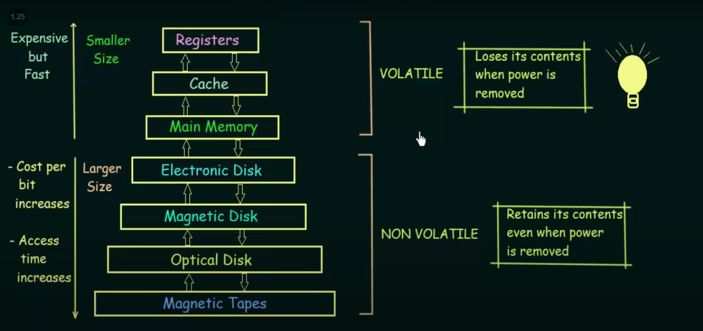

# Operating System Storage Notes

## 1. Basics of Operating System
- **Definition**: Software managing hardware and software resources
- **Key Functions**:
  - Memory management
  - Process management
  - Device management
  - File management

## 2. Storage Structure

### Basic Structure
```plaintext
+-----------------+
|     CPU        |
+-----------------+
        ↕
+-----------------+
|  Main Memory   |
+-----------------+
        ↕
+-----------------+
|   Secondary    |
|    Storage     |
+-----------------+
```



### Characteristics
- **Speed**: Faster at top, slower at bottom
- **Cost**: More expensive at top, cheaper at bottom
- **Capacity**: Smaller at top, larger at bottom

## 3. Storage Hierarchy

### Levels (Top to Bottom)
1. **Registers**
   - Fastest
   - Inside CPU
   - Few bytes per register

2. **Cache**
   - L1, L2, L3
   - Very fast
   - Small capacity
   - High cost

3. **Main Memory (RAM)**
   - Medium speed
   - Volatile
   - Directly accessible by CPU

4. **Secondary Storage**
   - Hard drives
   - SSDs
   - Large capacity
   - Non-volatile

5. **Tertiary Storage**
   - Tape drives
   - Optical media
   - Very slow, very cheap

## 4. Main Memory vs Secondary Memory

### Main Memory (RAM)
- **Characteristics**:
  - Volatile
  - Direct CPU access
  - Random access
  - Fast (50-100ns access time)

### Secondary Memory
- **Characteristics**:
  - Non-volatile
  - Indirect access via I/O
  - Sequential or random access
  - Slow (5-10ms access time)

## 5. Volatile vs Non-Volatile Devices

### Volatile Devices
- Require power to maintain state
- Examples:

  - RAM
  - CPU Cache
  - CPU Registers


### Non-Volatile Devices
- Retain data without power
- Examples:

  - Hard Disk Drives
  - Solid State Drives
  - ROM
  - Flash Memory
  - Optical Disks


### Comparison Table
```plaintext
| Feature     | Volatile       | Non-Volatile   |
|-------------|---------------|----------------|
| Power Needed| Yes           | No             |
| Data Loss   | On power off  | Persistent     |
| Speed       | Faster        | Slower         |
| Cost/GB     | Higher        | Lower          |
| Use Case    | Active data   | Storage        |
```