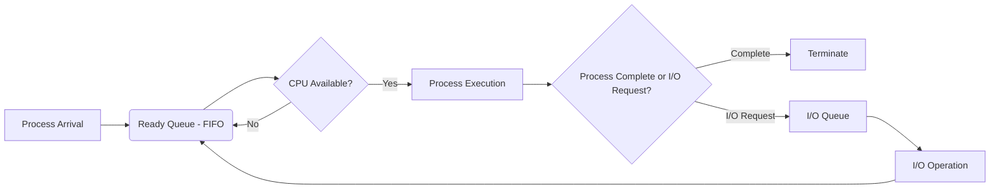

# First-Come, First-Served (FCFS) Scheduling

## 1. Overview

*   **Definition:** Processes are executed in the order they arrive in the ready queue.
*   **Implementation:** Uses a First-In, First-Out (FIFO) queue.
*   **Simplicity:** Easiest scheduling algorithm to understand and implement.

## 2. Characteristics

*   **Queueing:** When a new process enters the ready queue, its Process Control Block (PCB) is linked to the tail of the queue.
*   **Waiting Time:** Can result in long waiting times, especially if a long process arrives first.
*   **Non-Preemptive:** Once a process is allocated the CPU, it retains control until it either completes or performs an I/O operation.
*   **Time-Sharing Inefficiency:** Not suitable for time-sharing systems because it doesn't guarantee each user a fair share of the CPU.

## 3. Block Diagram

````markdown

````

## 4. Example

Consider the following processes:

| Process | Arrival Time | Burst Time |
| ------- | ------------ | ---------- |
| P1      | 0            | 8          |
| P2      | 1            | 4          |
| P3      | 2            | 9          |
| P4      | 3            | 5          |

### Gantt Chart

```gantt
    dateFormat  YYYY-MM-DD
    title FCFS Scheduling Gantt Chart
    axisFormat  %S
    
    section FCFS
    P1 :2025-03-01, 8s
    P2 :2025-03-01 + 8 seconds, 4s
    P3 :2025-03-01 + 12 seconds, 9s
    P4 :2025-03-01 + 21 seconds, 5s
```

### Calculations

*   **P1:**
    *   Waiting Time: 0
    *   Turnaround Time: 8
*   **P2:**
    *   Waiting Time: 8 - 1 = 7
    *   Turnaround Time: 7 + 4 = 11
*   **P3:**
    *   Waiting Time: 12 - 2 = 10
    *   Turnaround Time: 10 + 9 = 19
*   **P4:**
    *   Waiting Time: 21 - 3 = 18
    *   Turnaround Time: 18 + 5 = 23

### Averages

*   Average Waiting Time: (0 + 7 + 10 + 18) / 4 = 8.75
*   Average Turnaround Time: (8 + 11 + 19 + 23) / 4 = 15.25

## 5. Disadvantages

*   **Convoy Effect:** Short processes may have to wait behind a long process, leading to increased waiting times.
*   **Not Optimal:** Does not minimize average waiting time or turnaround time.

