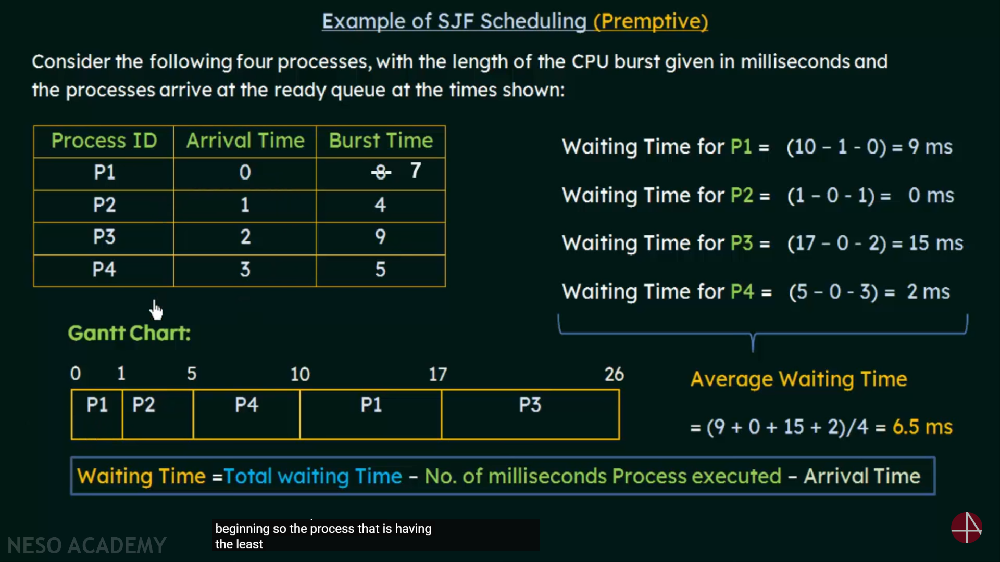

# Shortest Job First (SJF) Scheduling Algorithm

## 1. Overview

*   **Definition:** A scheduling algorithm that selects the process with the smallest burst time (execution time) for execution.
*   **Goal:** Minimize average waiting time.
*   **Types:** Non-Preemptive and Preemptive.

## 2. Non-Preemptive Shortest Job First (SJF)

*   **Definition:** Once a process starts executing, it runs to completion.
*   **Process:** The scheduler selects the process with the shortest burst time from the ready queue and allocates the CPU to it.
*   **Advantage:** Simple to implement.
*   **Disadvantage:** A long process arriving earlier can delay shorter processes.

### Example

| Process | Arrival Time | Burst Time |
| ------- | ------------ | ---------- |
| P1      | 0            | 8          |
| P2      | 1            | 4          |
| P3      | 2            | 9          |
| P4      | 3            | 5          |

### Gantt Chart

````markdown
```mermaid
gantt
    dateFormat  YYYY-MM-DD
    title Non-Preemptive SJF Gantt Chart
    axisFormat  %S
    
    section SJF
    P1 :2025-03-01, 8s
    P2 :2025-03-01 + 8 seconds, 4s
    P4 :2025-03-01 + 12 seconds, 5s
    P3 :2025-03-01 + 17 seconds, 9s
```
````

### Calculations

*   **P1:** Waiting Time = 0, Turnaround Time = 8
*   **P2:** Waiting Time = 8 - 1 = 7, Turnaround Time = 11
*   **P4:** Waiting Time = 12 - 3 = 9, Turnaround Time = 14
*   **P3:** Waiting Time = 17 - 2 = 15, Turnaround Time = 24

Average Waiting Time = (0 + 7 + 9 + 15) / 4 = 7.75

## 3. Preemptive Shortest Job First (SJF)

*   **Definition:** If a new process arrives with a shorter burst time than the remaining time of the current process, the current process is preempted.
*   **Also Known As:** Shortest Remaining Time First (SRTF).
*   **Process:** The scheduler always chooses the process with the smallest remaining burst time.
*   **Advantage:** Further reduces average waiting time.
*   **Disadvantage:** Higher overhead due to context switching.

### Example


## 4. Calculation of Average Waiting Times

*   **Non-Preemptive SJF:** Calculate the waiting time for each process based on the order of execution.
*   **Preemptive SJF:** Recalculate remaining burst times and waiting times whenever a new process arrives.

## 5. Problems with SJF

*   **Starvation:** Long processes may never get executed if shorter processes keep arriving.
*   **Prediction of Burst Time:** Difficult to predict the burst time of a process accurately.

### Approaches to Address Problems

*   **Aging:** Increase the priority of processes that have been waiting for a long time.
*   **Historical Data:** Use historical data to estimate burst times.

Would you like to explore the aging technique or other scheduling algorithms like Round Robin?