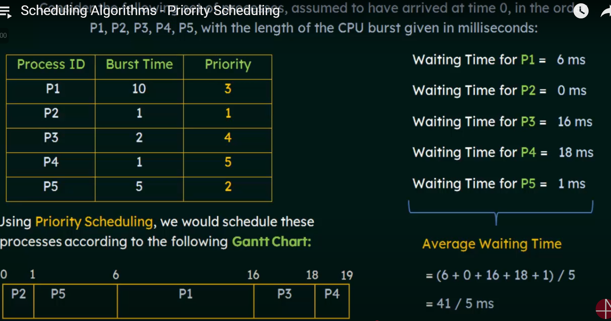

# Priority Scheduling Algorithm

## 1. Overview

*   **Definition:** A scheduling algorithm that assigns a priority to each process, and the process with the highest priority is executed first.
*   **Priority Assignment:** Priorities can be assigned based on various factors, such as process importance, resource requirements, or user preferences.
*   **Types:** Preemptive and Non-Preemptive.

## 2. Preemptive vs. Non-Preemptive Priority Scheduling

*   **Preemptive:** If a new process arrives with a higher priority than the currently running process, the current process is preempted.
*   **Non-Preemptive:** Once a process starts executing, it runs to completion, regardless of whether higher-priority processes arrive later.

## 3. Calculation of Average Waiting Time

*   **Process:**
    1.  Sort processes based on priority (highest priority first).
    2.  Calculate the waiting time for each process.
    3.  Calculate the average waiting time.

### Example1

| Process | Arrival Time | Burst Time | Priority |
| ------- | ------------ | ---------- | -------- |
| P1      | 0            | 10         | 3        |
| P2      | 0            | 1          | 1        |
| P3      | 0            | 2          | 4        |
| P4      | 0            | 1          | 5        |
| P5      | 0            | 5          | 2        |

(Lower number indicates higher priority)

### Calculations

*   **P2:** Waiting Time = 0
*   **P5:** Waiting Time = 1
*   **P1:** Waiting Time = 6
*   **P3:** Waiting Time = 16
*   **P4:** Waiting Time = 18

Average Waiting Time = (0 + 1 + 6 + 16 + 18) / 5 = 8.2

### Example2



## 4. Problem: Starvation

*   **Definition:** Low-priority processes may never get executed if higher-priority processes keep arriving.
*   **Also Known As:** Indefinite Blocking.

## 5. Solution: Aging

*   **Definition:** Gradually increase the priority of processes that have been waiting for a long time.
*   **Process:**
    1.  Increment the priority of waiting processes periodically.
    2.  Ensure that no process waits indefinitely.
*   **Example:** Increase the priority of a process by 1 every 15 minutes of waiting.

### Code Example (Aging)

```python
class Process:
    def __init__(self, pid, priority, burst_time, arrival_time):
        self.pid = pid
        self.priority = priority
        self.burst_time = burst_time
        self.arrival_time = arrival_time
        self.waiting_time = 0
        self.age = 0

def aging(processes, time_quantum):
    for process in processes:
        process.age += time_quantum
        process.priority -= process.age  # Reduce priority (lower value = higher priority)

# Example Usage
processes = [
    Process("P1", 3, 10, 0),
    Process("P2", 1, 1, 0),
    Process("P3", 4, 2, 0),
    Process("P4", 5, 1, 0),
    Process("P5", 2, 5, 0)
]

# Simulate aging every 10 time units
aging(processes, 10)

# Print updated priorities
for process in processes:
    print(f"{process.pid}: Priority = {process.priority}")
```

