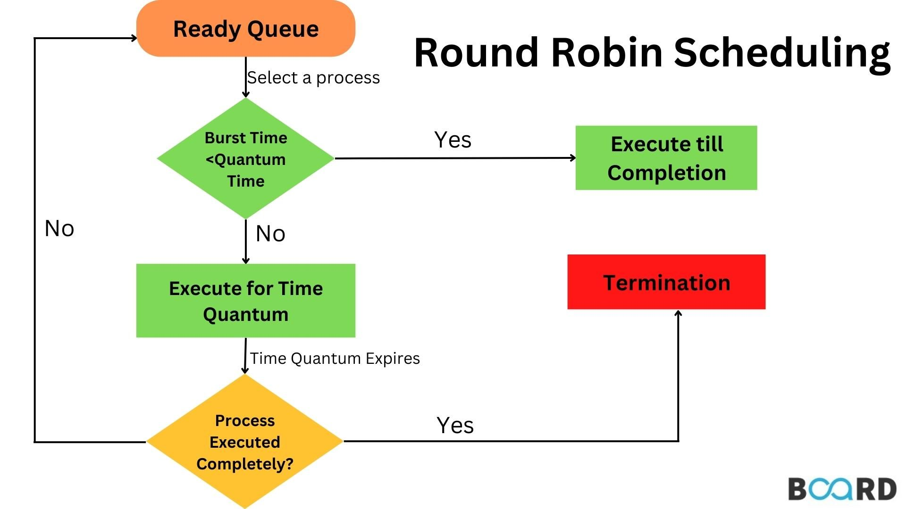
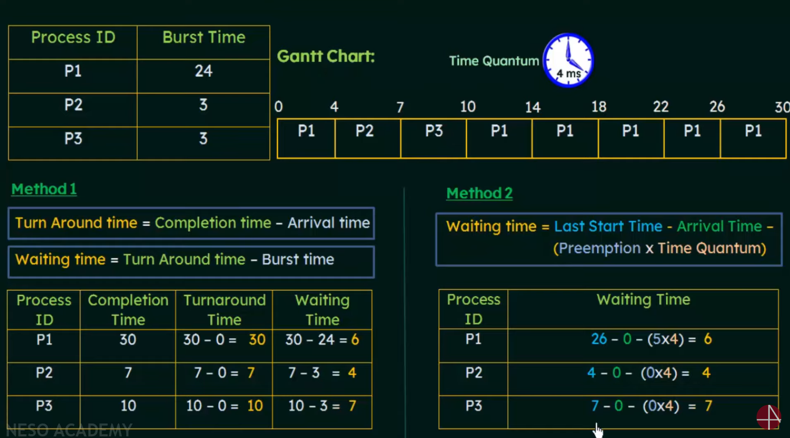

# Round-Robin (RR) Scheduling Algorithm

## 1. Overview

*   **Definition:** A preemptive scheduling algorithm designed for time-sharing systems.
*   **Time Quantum:** Each process is given a fixed time slice (quantum) to execute.
*   **Fairness:** Ensures that each process gets a fair share of the CPU.

## 2. Basic Concepts

*   **Ready Queue:** Processes are placed in a circular queue.
*   **Time Slice:** The CPU scheduler goes through the ready queue, allocating the CPU to each process for a fixed time quantum.
*   **Preemption:** If a process does not complete within its time quantum, it is preempted and placed back at the end of the ready queue.
*   **Context Switching:** Switching between processes involves saving the state of the current process and loading the state of the next process.

## 3. Implementation

1.  **Ready Queue:** Maintain a queue of ready processes.
2.  **Time Quantum:** Define a fixed time quantum (e.g., 10-100 milliseconds).
3.  **Scheduler Loop:**
    *   Pick the first process from the ready queue.
    *   Allocate the CPU to the process for the time quantum.
    *   If the process completes within the time quantum, remove it from the queue.
    *   If the process does not complete, preempt it and place it at the end of the queue.
    *   Repeat until the ready queue is empty.

## 4. Example

| Process | Arrival Time | Burst Time |
| ------- | ------------ | ---------- |
| P1      | 0            | 24         |
| P2      | 0            | 3          |
| P3      | 0            | 3          |

Time Quantum = 4

### Calculations

*   **P1:**
    *   Waiting Time: (0) + (10-4) + (14-10) + (18-14) + (22-18) = 0 + 6 + 4 + 4 + 4 = 18
    *   Turnaround Time: 18 + 24 = 42
*   **P2:**
    *   Waiting Time: 4
    *   Turnaround Time: 4 + 3 = 7
*   **P3:**
    *   Waiting Time: 7
    *   Turnaround Time: 7 + 3 = 10

Average Waiting Time = (18 + 4 + 7) / 3 = 9.67

## 5. Key Considerations

*   **Time Quantum Size:**
    *   **Small Quantum:** Increases context switching overhead.
    *   **Large Quantum:** Approximates FCFS scheduling.
    *   **Optimal Value:** Should be large enough to allow most processes to complete within a single quantum, but not so large that it degrades response time.
*   **Context Switching Overhead:** The time it takes to switch between processes. Should be minimized for better performance.

## 6. Advantages

*   **Fairness:** Each process gets a fair share of the CPU.
*   **Responsiveness:** Provides good response time, especially for interactive systems.

## 7. Disadvantages

*   **Overhead:** Higher context switching overhead compared to FCFS.
*   **Performance Impact:** Performance depends heavily on the choice of the time quantum.

