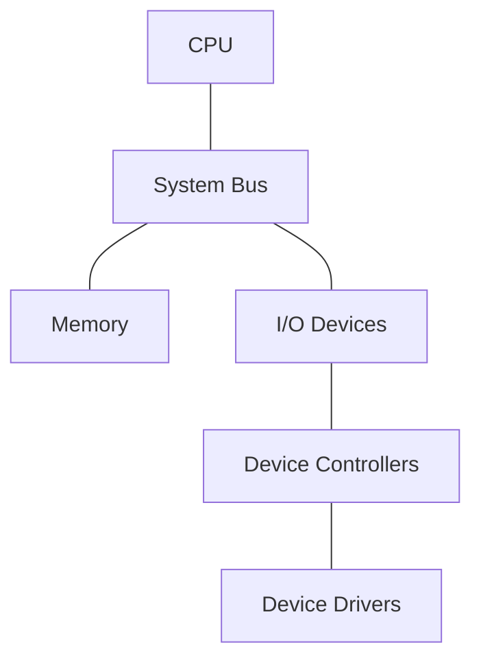
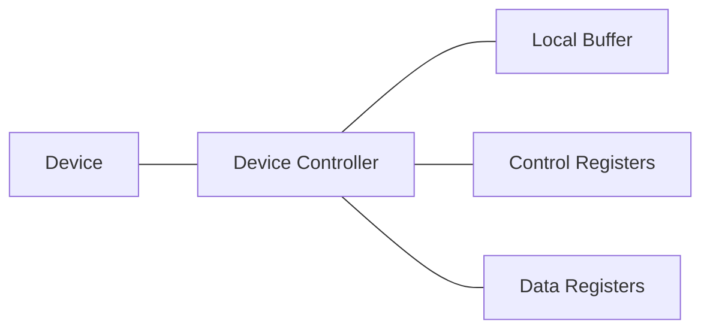
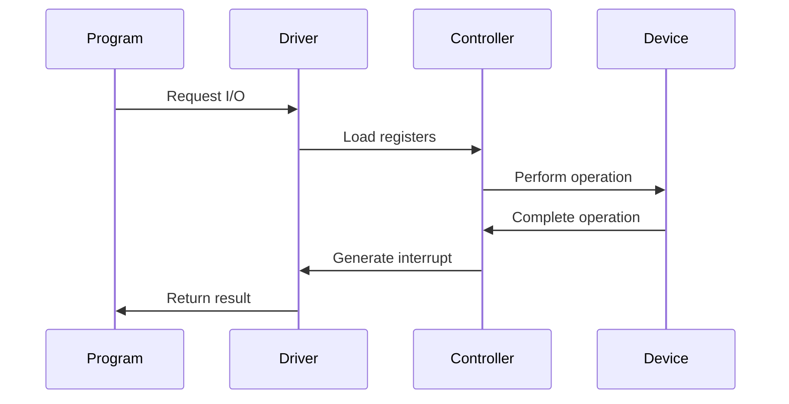
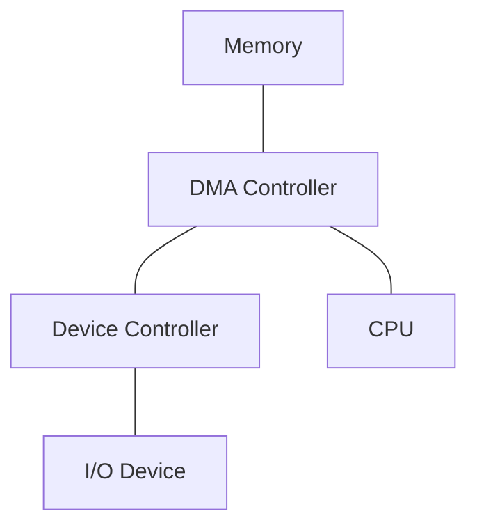

# Operating System I/O Management

## Input/Output Structure Overview 

### Core Components
- **CPU**
- **Memory**
- **I/O Devices**
- **System Bus**



## Device Controllers 

### Characteristics:
- Acts as interface between device and system bus
- Contains local buffer storage
- Has special-purpose registers
- Works independently from CPU



## Device Drivers 

### Key Features:
- Software interface to hardware devices
- OS-specific implementation
- Provides uniform interface for OS

```c
// Simplified Device Driver Structure
struct device_driver {
    void (*init)(void);
    int (*read)(char* buffer, size_t size);
    int (*write)(const char* buffer, size_t size);
    void (*interrupt_handler)(void);
};
```

## I/O Operation Workflow 

### Steps:
1. Program initiates I/O
2. Device driver loads controller registers
3. Controller starts device operation
4. Controller signals completion via interrupt
5. Driver returns control to OS



## Direct Memory Access (DMA) 

- DMA allows the device controller to transfer entire data blocks directly to/from memory without CPU intervention.
- Reduces CPU overhead
- Handles bulk data transfers
- One interrupt per block
- Parallel processing capability


