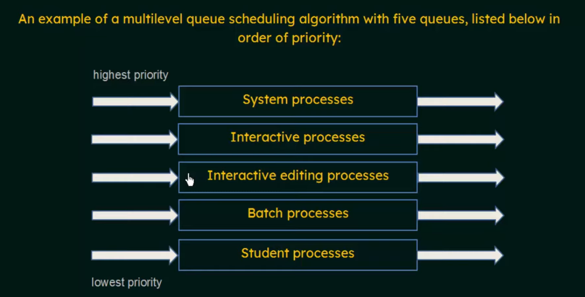

# Multilevel Queue Scheduling Algorithm

## 1. Overview

*   **Definition:** A scheduling algorithm that divides the ready queue into multiple separate queues and a process of one queue can never be moved/assigned to another queue.
*   **Purpose:** To categorize processes based on characteristics like priority, process type, or resource requirements.
*   **Queue Assignment:** Processes are permanently assigned to one queue based on certain criteria.

## 2. Queue Characteristics

*   **Multiple Queues:** The ready queue is divided into several queues (e.g., foreground/interactive, background/batch).
*   **Scheduling Algorithms:** Each queue can have its own scheduling algorithm (e.g., Round Robin for foreground, FCFS for background).
*   **Priority Levels:** Queues can be assigned different priority levels.

## 3. Common Types of Queues

*   **Foreground (Interactive) Queue:**
    *   For interactive processes that require quick response times.
    *   Scheduling Algorithm: Typically Round Robin (RR).
*   **Background (Batch) Queue:**
    *   For batch processes that do not require immediate interaction.
    *   Scheduling Algorithm: Typically First-Come, First-Served (FCFS).
*   **System Processes Queue:**
    *   For OS processes.
    *   Highest priority.
*   **Student Processes Queue:**
    *   Lower priority.

## 4. Scheduling Between Queues

*   **Fixed Priority Scheduling:**
    *   Each queue has absolute priority over lower-priority queues.
    *   Processes in the highest-priority queue are executed first.
    *   Starvation is possible for lower-priority queues.
*   **Time Slice (Time Sharing):**
    *   Each queue gets a certain amount of CPU time.
    *   For example: 80% of CPU time to foreground queue (using RR), 20% to background queue (using FCFS).

## 5. Example

Consider a system with three queues:

1.  **System Processes:** Highest priority, uses FCFS.
2.  **Interactive Processes:** Medium priority, uses Round Robin (quantum = 4).
3.  **Batch Processes:** Lowest priority, uses FCFS.

The scheduler first executes all processes in the system queue. Once the system queue is empty, it switches to the interactive queue and executes processes using Round Robin. If the interactive queue is empty, it executes processes in the batch queue using FCFS.

## 6. Advantages

*   **Flexibility:** Allows different scheduling policies for different process types.
*   **Responsiveness:** Can provide better response times for interactive processes.

## 7. Disadvantages

*   **Complexity:** More complex to implement and manage than single-queue scheduling algorithms.
*   **Starvation:** Lower-priority queues may experience starvation if higher-priority queues are never empty.
*   **Queue Assignment:** Difficult to assign processes to the appropriate queue.

## 8. Addressing Starvation

*   **Aging:** Gradually increase the priority of processes in lower-priority queues.
*   **Time Quotas:** Ensure that each queue receives a minimum amount of CPU time.

