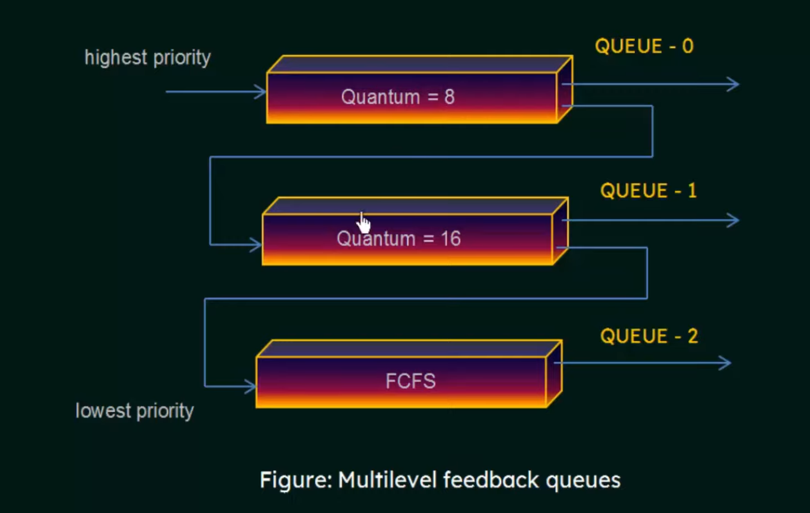

# Multilevel Feedback-Queue Scheduling Algorithm

## 1. Overview

*   **Definition:** An extension of the multilevel queue scheduling algorithm that allows processes to move between queues.
*   **Purpose:** To improve responsiveness and adapt to the changing behavior of processes.
*   **Dynamic Priority:** Processes can change their priority based on their CPU usage and waiting time.

## 2. Key Concepts

*   **Multiple Queues:** The ready queue is divided into multiple queues with different priority levels.
*   **Dynamic Movement:** Processes can move between queues based on their behavior.
*   **Feedback Mechanism:** The scheduler uses feedback to adjust the priority of processes.
*   **Aging:** Processes that wait too long in lower-priority queues are moved to higher-priority queues.

## 3. Algorithm Details

1.  **Initial Queue:** A new process enters the highest-priority queue.
2.  **Time Quantum:** Each queue has a specific time quantum.
3.  **Process Behavior:**
    *   If a process uses its entire time quantum in a queue, it is moved to a lower-priority queue.
    *   If a process voluntarily relinquishes the CPU (e.g., for I/O), it remains in the same queue.
4.  **Queue Scheduling:** Each queue uses its own scheduling algorithm (e.g., Round Robin, FCFS).
5.  **Aging:** Processes that remain in lower-priority queues for a long time are moved to higher-priority queues to prevent starvation.

## 4. Example

Consider a system with three queues:

1.  **Q1:** Highest priority, Round Robin (quantum = 8 ms)
2.  **Q2:** Medium priority, Round Robin (quantum = 16 ms)
3.  **Q3:** Lowest priority, FCFS

*   A new process enters Q1.
*   If the process uses its entire 8 ms in Q1, it is moved to Q2.
*   If the process uses its entire 16 ms in Q2, it is moved to Q3.
*   Processes in Q3 are served using FCFS.
*   Aging: If a process waits too long in Q3, it is moved back to Q1.

## 5. Advantages

*   **Flexibility:** Adapts to different process behaviors.
*   **Responsiveness:** Provides good response times for interactive processes.
*   **Starvation Prevention:** Aging prevents starvation of low-priority processes.

## 6. Disadvantages

*   **Complexity:** More complex to implement and manage than other scheduling algorithms.
*   **Configuration:** Requires careful configuration of queue parameters (number of queues, time quantum, aging policy).

## 7. Addressing Challenges

*   **Number of Queues:** Determine the optimal number of queues based on system requirements.
*   **Time Quantum:** Adjust the time quantum for each queue to balance responsiveness and overhead.
*   **Aging Policy:** Implement an effective aging policy to prevent starvation without overly disrupting the scheduling process.

