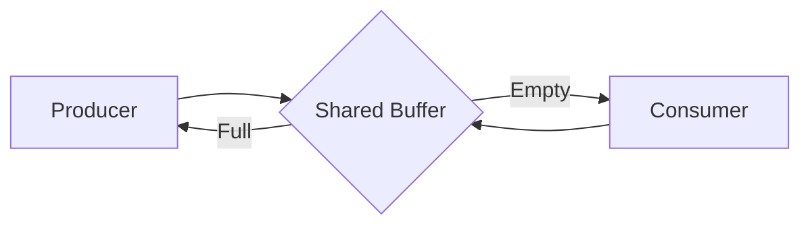
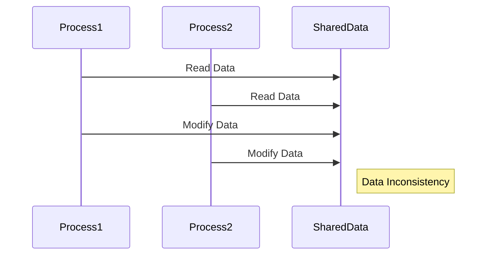
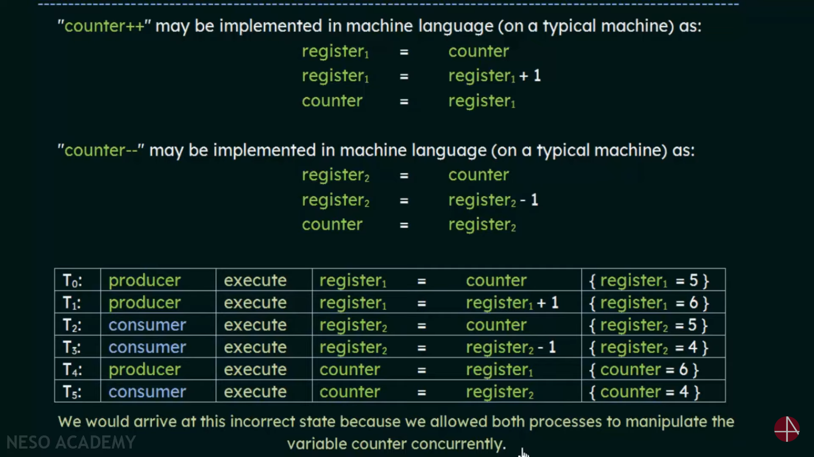

# Process Synchronization

## 1. Overview

*   **Definition:** The coordination of multiple processes to ensure that they execute in a specific order and access shared resources in a controlled manner.
*   **Purpose:** To maintain data consistency and integrity when multiple processes access shared resources concurrently.

## 2. Cooperating Processes

*   **Definition:** Processes that can affect or be affected by other processes executing in the system.
*   **Reasons for Cooperation:**
    *   **Information Sharing:** Multiple processes may need to access the same data.
    *   **Computation Speedup:** Dividing a task into subtasks that can be executed concurrently.
    *   **Modularity:** Dividing system functions into separate processes.
    *   **Convenience:** Allowing users to work on multiple tasks simultaneously.

## 3. Shared Memory Systems and Producer-Consumer Problem

### Shared Memory Systems

*   **Definition:** A method of interprocess communication where multiple processes share a common memory region.
*   **Advantages:**
    *   Fast and efficient communication.
    *   Suitable for processes within the same machine.
*   **Disadvantages:**
    *   Requires synchronization mechanisms to avoid race conditions.
    *   Complex to manage memory access.

### Producer-Consumer Problem

*   **Definition:** A classic concurrency problem where one or more producers generate data and one or more consumers consume that data.
*   **Components:**
    *   **Producer:** Generates data and places it in a shared buffer.
    *   **Consumer:** Retrieves data from the shared buffer and consumes it.
    *   **Shared Buffer:** A fixed-size buffer that holds the data.
*   **Synchronization Requirements:**
    *   The producer must not add data to a full buffer.
    *   The consumer must not retrieve data from an empty buffer.
    *   Concurrent access to the buffer must be synchronized.

### Producer-Consumer Diagram

````markdown

````

## 4. Race Condition

*   **Definition:** A situation where multiple processes access and manipulate shared data concurrently, and the final outcome depends on the particular order of execution.
*   **Cause:** Uncontrolled access to shared resources.
*   **Result:** Data inconsistency and unpredictable behavior.

### Race Condition Diagram

````markdown

````


## 5. Synchronization Mechanisms

*   **Purpose:** To prevent race conditions and ensure data consistency.
*   **Common Techniques:**
    *   **Mutex Locks:** Provide exclusive access to shared resources.
    *   **Semaphores:** Generalize mutex locks to allow multiple processes to access a resource concurrently, up to a limit.
    *   **Monitors:** High-level synchronization construct that encapsulates shared data and the operations that access it.
