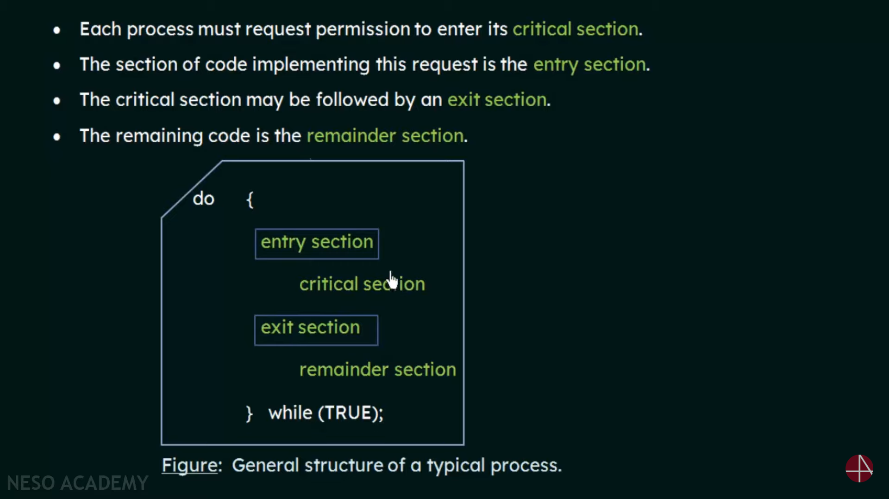
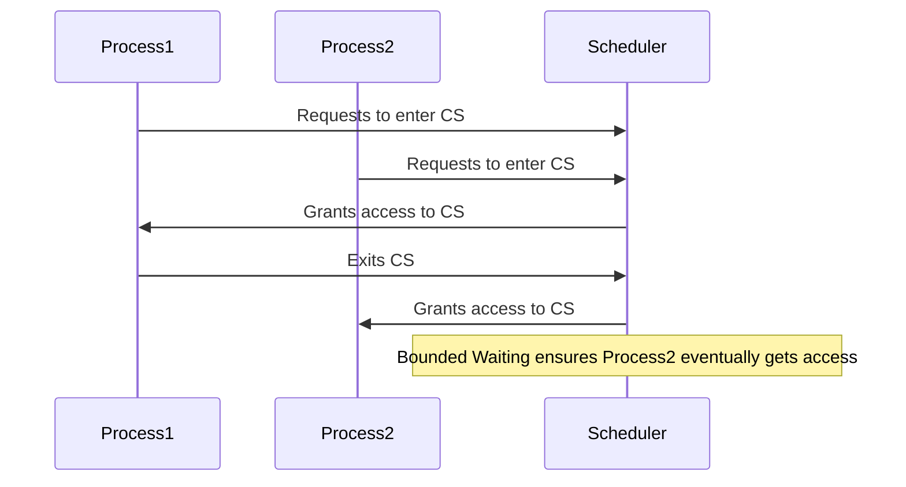

# Critical-Section 

## 1. Critical Section

*   **Definition:** A segment of code in which a process accesses shared resources (e.g., shared variables, data structures).
*   **Importance:** Requires protection to prevent race conditions and ensure data consistency.

## 2. The Critical-Section Problem

*   **Definition:** Designing a protocol that allows cooperating processes to access shared resources in a safe and orderly manner.
*   **Goal:** Ensure that when one process is executing in its critical section, no other process is allowed to execute in its critical section.

## 3. Entry, Exit, and Remainder Sections

*   **Entry Section:**
    *   Code that a process executes to request permission to enter its critical section.
    *   Implements the "lock" mechanism.
*   **Exit Section:**
    *   Code that a process executes after leaving its critical section.
    *   Releases the "lock" to allow other processes to enter.
*   **Remainder Section:**
    *   The remaining code of the process, outside the critical section.



## 4. Mutual Exclusion

*   **Definition:** Only one process can be in its critical section at any given time.
*   **Requirement:** Essential to prevent race conditions and maintain data consistency.

## 5. Progress

*   **Definition:** If no process is in its critical section and some processes want to enter their critical sections, only those processes that are not in their remainder sections can participate in deciding which will enter its critical section next.
*   **Requirement:** Ensures that the decision of which process enters the critical section next cannot be postponed indefinitely.

## 6. Bounded Waiting

*   **Definition:** There is a limit on the amount of time a process has to wait to enter its critical section.
*   **Requirement:** Ensures that no process is starved and that every process eventually gets a chance to enter its critical section.

### Bounded Waiting Diagram

````markdown

````

## Summary of CS Requirements

*   **Mutual Exclusion:** Only one process in the critical section.
*   **Progress:** If no process is in the critical section, a process that wants to enter should be able to do so.
*   **Bounded Waiting:** There is a limit to how long a process has to wait to enter the critical section.

