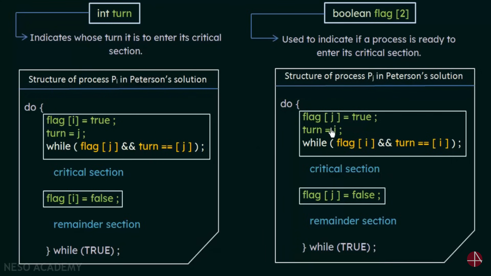

# Peterson's Solution

## 1. Overview

*   **Definition:** A classic software-based solution to the critical-section problem for two processes.
*   **Purpose:** To provide mutual exclusion, progress, and bounded waiting.
*   **Limitation:** Only applicable to two processes.

## 2. Shared Variables

*   `int turn;`
    *   Indicates whose turn it is to enter the critical section.
    *   If `turn == i`, then process `Pi` is allowed to enter its critical section.
*   `boolean flag[2];`
    *   Indicates whether a process wants to enter the critical section.
    *   `flag[i] == true` means process `Pi` wants to enter the critical section.

## 3. Algorithm

```
Process Pi:

do {
    flag[i] = true;       // Indicate that Pi wants to enter the critical section
    turn = j;             // Give the other process (Pj) a chance
    while (flag[j] && turn == j);  // Wait if Pj also wants to enter and it's Pj's turn

    // Critical Section
    ...

    flag[i] = false;      // Indicate that Pi is leaving the critical section

    // Remainder Section
    ...
} while (true);
```


## 4. Explanation

1.  **Entry Section:**
    *   `flag[i] = true;`: Process `Pi` sets its flag to `true`, indicating its desire to enter the critical section.
    *   `turn = j;`: Process `Pi` gives the other process `Pj` a chance to enter the critical section by setting `turn` to `j`.
    *   `while (flag[j] && turn == j);`: Process `Pi` waits as long as process `Pj` also wants to enter the critical section (`flag[j] == true`) and it is `Pj`'s turn (`turn == j`).
2.  **Critical Section:**
    *   If `Pi` passes the `while` loop, it can safely enter its critical section.
3.  **Exit Section:**
    *   `flag[i] = false;`: Process `Pi` sets its flag to `false`, indicating that it is leaving the critical section.
4.  **Remainder Section:**
    *   Process `Pi` executes its remaining code.

## 5. Properties

*   **Mutual Exclusion:** Only one process can be in the critical section at a time.
*   **Progress:** If one process wants to enter the critical section and the other is not interested, the first process can enter.
*   **Bounded Waiting:** A process will not wait indefinitely to enter the critical section.

## 6. Proof of Mutual Exclusion

*   Assume both `flag[i]` and `flag[j]` are `true`, and `turn` is either `i` or `j`.
*   If `turn == i`, then process `Pj` is waiting in the `while` loop.
*   If `turn == j`, then process `Pi` is waiting in the `while` loop.
*   Therefore, both processes cannot be in the critical section simultaneously.

## 7. Proof of Progress

*   If one process (e.g., `Pi`) wants to enter the critical section and the other process (`Pj`) does not (`flag[j] == false`), then `Pi` will not wait in the `while` loop and can enter the critical section.

## 8. Proof of Bounded Waiting

*   When a process wants to enter the critical section, it sets `turn = j`, giving the other process a chance.
*   If both processes want to enter, the value of `turn` determines which process enters first.
*   Since `turn` can only be either `i` or `j`, a process will not wait indefinitely.

## 9. Limitations

*   **Two Processes Only:** Only works for two processes.
*   **Busy Waiting:** Processes continuously check the `flag` and `turn` variables, consuming CPU time while waiting.
