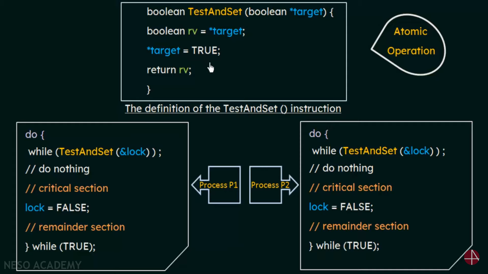

# Test-and-Set Lock

## 1. Overview

*   **Definition:** A hardware-based synchronization mechanism used to provide mutual exclusion.
*   **Purpose:** To ensure that only one process can access a critical section at any given time.
*   **Mechanism:** Uses an atomic instruction to test and modify the value of a lock variable.

## 2. Atomic Instruction

*   **Definition:** An instruction that executes as a single, uninterruptible unit.
*   **Importance:** Ensures that the test and set operations are performed without interference from other processes.

## 3. Test-and-Set Operation

*   **Function:** `TestAndSet(boolean &lock)`
*   **Behavior:**
    1.  Saves the current value of the lock variable.
    2.  Sets the lock variable to `TRUE`.
    3.  Returns the original value of the lock variable.
*   **Atomicity:** The entire operation is performed atomically.

### Pseudocode

```
boolean TestAndSet(boolean &lock) {
    boolean oldValue = lock;
    lock = TRUE;
    return oldValue;
}
```

## 4. Implementation

1.  **Lock Variable:** A shared boolean variable (`lock`) initialized to `FALSE`.
2.  **Entry Section:**
    *   Use the `TestAndSet` instruction to acquire the lock.
    *   Wait in a loop until `TestAndSet` returns `FALSE`.
3.  **Critical Section:**
    *   Once the lock is acquired, the process can enter its critical section.
4.  **Exit Section:**
    *   Set the lock variable to `FALSE` to release the lock.
5.  **Remainder Section:**
    *   The remaining code of the process, outside the critical section.

### Code Example (Pseudocode)



```
boolean lock = FALSE; // Shared lock variable

do {
    while (TestAndSet(lock)); // Acquire lock (busy-wait)

    // Critical Section
    ...

    lock = FALSE; // Release lock

    // Remainder Section
    ...
} while (TRUE);
```

## 5. Properties

*   **Mutual Exclusion:** Only one process can be in the critical section at a time.
*   **Simplicity:** Relatively simple to implement.

## 6. Disadvantages

*   **Busy Waiting:** Processes continuously check the lock variable, consuming CPU time while waiting.
*   **Starvation:** Some processes may wait indefinitely to enter the critical section.
*   **Bounded Waiting Violation:** Does not guarantee bounded waiting.

## 7. Addressing Disadvantages

*   **Combining with Queues:** Use a queue to manage waiting processes and avoid busy waiting.
*   **Fairness Mechanisms:** Implement fairness mechanisms to prevent starvation.

