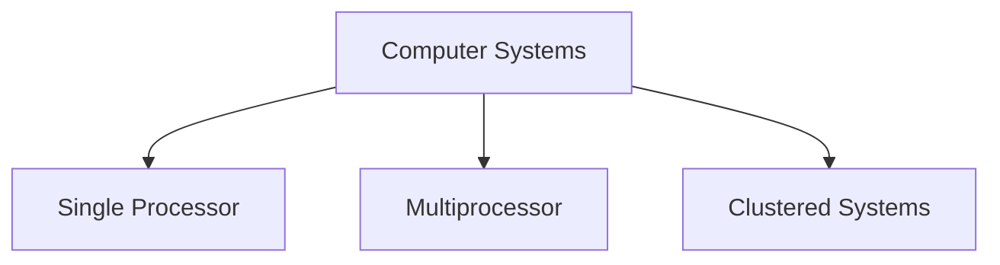
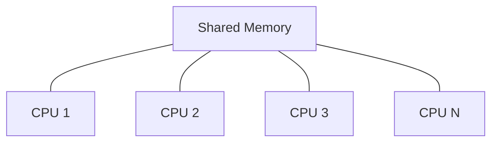
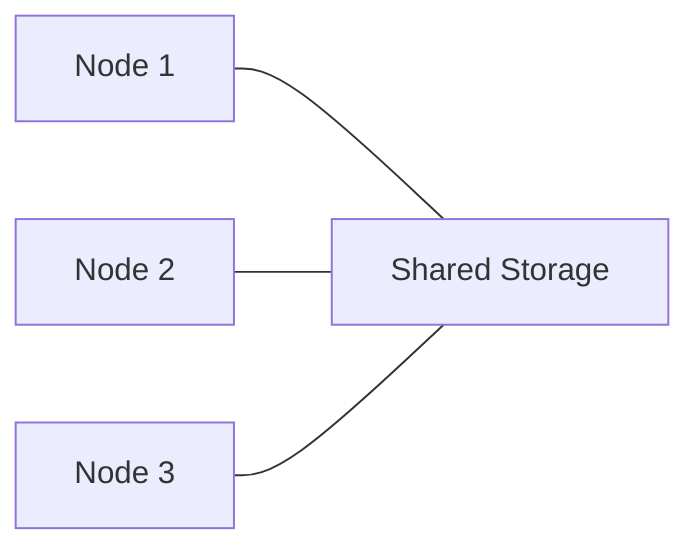

# Computer System Architecture 

## 1. Types of Computer Systems 🖥️

### Classification Based on Processors


## 2. Single Processor Systems 💻

### Characteristics:
- One main CPU
- von Neumann architecture
- Sequential processing
- Cost-effective for basic tasks

```python
# Example of sequential processing
def single_processor_task():
    task1()  # Must complete before task2
    task2()  # Must complete before task3
    task3()
```

## 3. Multiprocessor Systems 🔄

### Key Features:
- Multiple processors sharing
  - Memory
  - Bus
  - Clock
  - Peripheral devices

### 4. Advantages:
1. **Increased Throughput**
   - More work in less time
2. **Economy of Scale**
   - Shared peripherals and power supplies
3. **Enhanced Reliability**
   - Graceful degradation
   - Fault tolerance

## 5. Types of Multiprocessor Systems

### 5.1 Symmetric Multiprocessing (SMP) 🔱


#### Characteristics:
- Equal CPU priorities
- Shared memory
- Dynamic load balancing
- Complex scheduling

### 5.2 Asymmetric Multiprocessing (AMP) ⚖️
- Master-slave relationship
- Boss-worker configuration
- Specialized task distribution

## 6. Clustered Systems 🌐

### Definition:
Multiple independent systems working together

### Features:
- High availability
- Load balancing
- Parallel processing

## 7. Types of Clustered Systems

### 7.1 Symmetric Clustering


#### Characteristics:
- All nodes monitor each other
- Equal access to resources
- High availability

### 7.2 Asymmetric Clustering
- Hot-standby mode
- Primary-backup configuration

## Multiprocessor vs Distributed vs Clustered Systems

### Key Differences Matrix

| Feature | Multiprocessor | Distributed | Clustered |
|---------|---------------|-------------|------------|
| Location | Single machine | Global | Local datacenter |
| Memory | Shared | Independent | Shared storage |
| Communication | Bus/Cache | Network | High-speed LAN |
| OS | Single | Multiple possible | Usually same |
| Scalability | Limited | High | Medium |

### Use Cases 

#### Multiprocessor Systems
- Desktop workstations
- Small servers
- Gaming systems

#### Distributed Systems
- Cloud services
- Global applications
- Internet services
- Blockchain

#### Clustered Systems
- Database servers
- Web hosting
- High-availability services
- Scientific computing