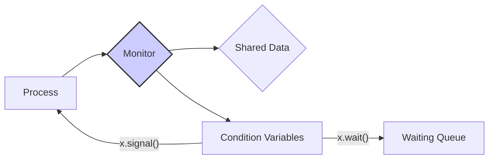

# Monitors

## 1. Overview

*   **Definition:** A high-level synchronization construct that provides a convenient and effective mechanism for process synchronization.
*   **Purpose:** To encapsulate shared data and the operations that access it, ensuring mutual exclusion and preventing race conditions.
*   **Components:**
    *   Shared data.
    *   A set of programmer-defined operations that access the shared data.
    *   Mutual exclusion mechanism.

## 2. Key Concepts

*   **Mutual Exclusion:** Only one process can be active within the monitor at any given time.
*   **Condition Variables:** Allow processes to wait inside the monitor until a specific condition is met.
*   **`wait()` Operation:** A process invokes `wait()` on a condition variable to suspend itself.
*   **`signal()` Operation:** A process invokes `signal()` on a condition variable to wake up one waiting process.

## 3. Structure of a Monitor

```
monitor monitor-name {
    // Shared variable declarations
    ...

    // Procedure P1
    void P1(...) {
        ...
    }

    // Procedure P2
    void P2(...) {
        ...
    }

    ...

    // Initialization code
    ...
}
```

## 4. Condition Variables

*   **Purpose:** To allow processes to wait inside the monitor until a specific condition is met.
*   **Operations:**
    *   `x.wait()`: Suspends the calling process until another process invokes `x.signal()`.
    *   `x.signal()`: Resumes exactly one suspended process. If no process is suspended, then the `signal()` operation has no effect.

## 5. Monitor with Condition Variables

````markdown

````

## 6. Monitor Implementation

*   **Mutual Exclusion:** Typically enforced by a lock associated with the monitor.
*   **Condition Variables:** Implemented using queues to store waiting processes.
*   **`wait()` Operation:**
    1.  Releases the monitor lock.
    2.  Adds the process to the waiting queue of the condition variable.
    3.  Blocks the process.
*   **`signal()` Operation:**
    1.  Removes a process from the waiting queue of the condition variable.
    2.  Wakes up the process.
    3.  Transfers the monitor lock to the awakened process.

## 7. Advantages

*   **Simplicity:** Easier to use and reason about compared to semaphores.
*   **Safety:** Enforces mutual exclusion automatically, reducing the risk of race conditions.
*   **Modularity:** Encapsulates shared data and operations, promoting modular design.

## 8. Disadvantages

*   **Complexity:** Can be complex to implement efficiently.
*   **Limited Concurrency:** Only one process can be active inside the monitor at any given time.

