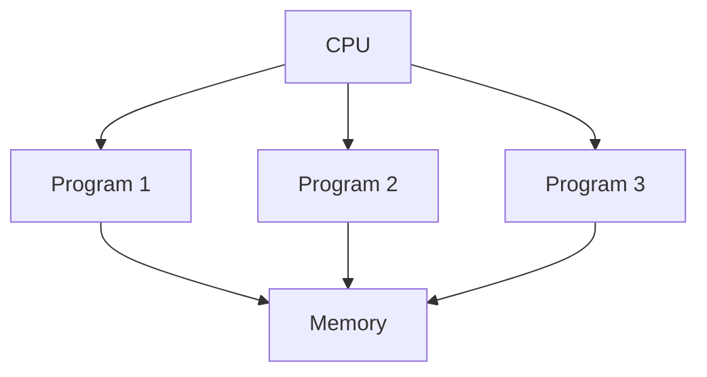
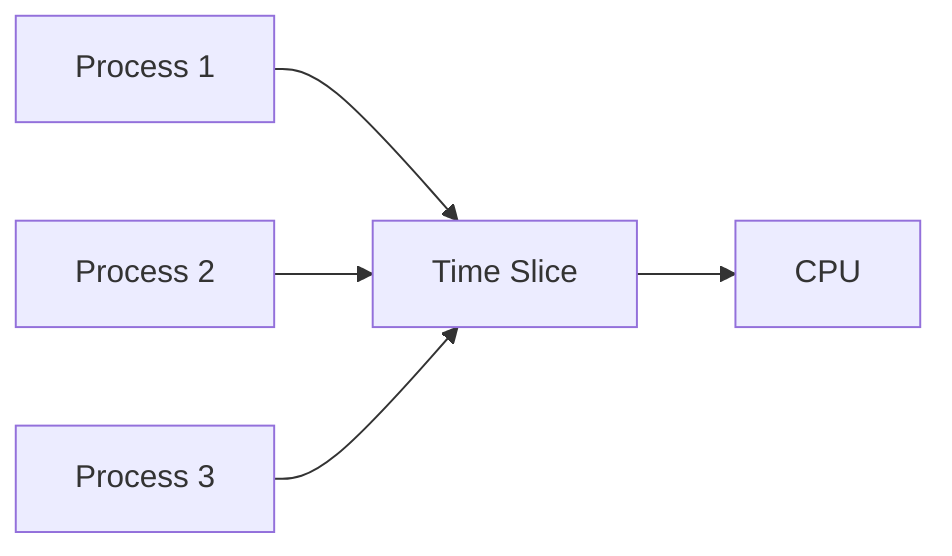

# Operating System Programming Models 

## 1. Multiprogramming 

### Definition
Multiprogramming is an OS capability to run multiple programs simultaneously on a single processor by switching between them.

### Key Concepts


### Characteristics
- CPU utilization optimization
- Memory management
- Process scheduling
- I/O handling

```python
# Example of multiprogramming concept
class MultiprogrammingOS:
    def __init__(self):
        self.memory = []
        self.cpu_queue = []
        self.io_queue = []

    def schedule_process(self, process):
        if process.waiting_for_io:
            self.io_queue.append(process)
        else:
            self.cpu_queue.append(process)
```

## 2. Time Sharing (Multitasking) 

### Definition
Time sharing extends multiprogramming by rapidly switching between processes, giving users the illusion of simultaneous execution.

### Key Features
- Interactive computing
- Quick response time
- CPU scheduling
- Memory protection



## Summary 

1. **Multiprogramming**
   - Focuses on CPU utilization
   - Batch processing oriented
   - Simple memory management

2. **Time Sharing**
   - Interactive computing
   - Complex scheduling
   - Advanced memory management
   - User-oriented approach