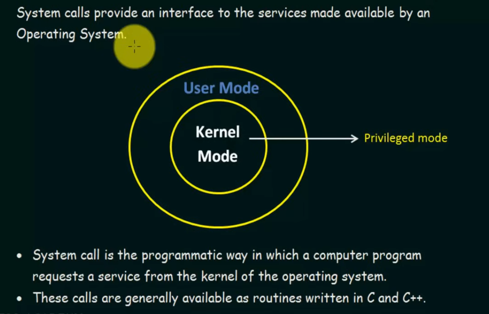

# Operating System: System Calls

## 1. System Calls
- Interface between user programs and OS kernel
- Provides controlled access to hardware resources
- Bridge between user mode and kernel mode
- Protected by hardware protection mechanism

## 2. User Mode
- Restricted access to hardware
- Limited privileges
- Cannot execute privileged instructions
- Most application programs run in user mode

## 3. Kernel Mode
- Full access to hardware
- Privileged mode of operation
- Can execute all CPU instructions
- OS kernel runs in kernel mode

## System Call Process
1. User program makes system call
2. CPU switches to kernel mode
3. OS executes system call
4. CPU switches back to user mode
5. Program continues execution
